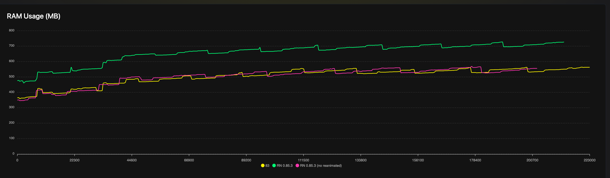

This is a new [**React Native**](https://reactnative.dev) project, bootstrapped using [`@react-native-community/cli`](https://github.com/react-native-community/cli).

# Getting Started

> **Note**: Make sure you have completed the [Set Up Your Environment](https://reactnative.dev/docs/set-up-your-environment) guide before proceeding.

> **Note**: This project uses [**pnpm**](https://pnpm.io) (pinned via the `packageManager` field). Install dependencies first:
>
> ```sh
> pnpm install
> ```

## Step 1: Start Metro

First, you will need to run **Metro**, the JavaScript build tool for React Native.

To start the Metro dev server, run the following command from the root of your React Native project:

```sh
pnpm start
```

## Step 2: Build and run your app

With Metro running, open a new terminal window/pane from the root of your React Native project, and use one of the following commands to build and run your Android or iOS app:

### Android

```sh
pnpm android
```

### iOS

For iOS, remember to install CocoaPods dependencies (this only needs to be run on first clone or after updating native deps).

The first time you create a new project, run the Ruby bundler to install CocoaPods itself:

```sh
bundle install
```

Then, and every time you update your native dependencies, run:

```sh
bundle exec pod install
```

For more information, please visit [CocoaPods Getting Started guide](https://guides.cocoapods.org/using/getting-started.html).

```sh
pnpm ios
```

If everything is set up correctly, you should see your new app running in the Android Emulator, iOS Simulator, or your connected device.

This is one way to run your app — you can also build it directly from Android Studio or Xcode.

## Step 3: Modify your app

Now that you have successfully run the app, let's make changes!

Open `App.tsx` in your text editor of choice and make some changes. When you save, your app will automatically update and reflect these changes — this is powered by [Fast Refresh](https://reactnative.dev/docs/fast-refresh).

When you want to forcefully reload, for example to reset the state of your app, you can perform a full reload:

- **Android**: Press the <kbd>R</kbd> key twice or select **"Reload"** from the **Dev Menu**, accessed via <kbd>Ctrl</kbd> + <kbd>M</kbd> (Windows/Linux) or <kbd>Cmd ⌘</kbd> + <kbd>M</kbd> (macOS).
- **iOS**: Press <kbd>R</kbd> in iOS Simulator.

## Congratulations! :tada:

You've successfully run and modified your React Native App. :partying_face:

### Now what?

- If you want to add this new React Native code to an existing application, check out the [Integration guide](https://reactnative.dev/docs/integration-with-existing-apps).
- If you're curious to learn more about React Native, check out the [docs](https://reactnative.dev/docs/getting-started).

# Performance profiling

This project ships helper scripts (in [`scripts/`](scripts/)) to build a
profiling-ready Android app and to measure performance (CPU / RAM / FPS) with
[Flashlight](https://docs.flashlight.dev) while a [Maestro](https://maestro.mobile.dev)
flow drives the app.

> **Note**: This repo uses **pnpm**. Replace `pnpm` with your package manager if needed.

## Prerequisites

- A connected Android device or running emulator (`adb devices`).
- [Maestro](https://maestro.mobile.dev/getting-started/installing-maestro) installed.
- [Flashlight](https://docs.flashlight.dev) installed (only needed for the perf test):
  ```sh
  curl https://get.flashlight.dev | bash
  ```

## Step 1: Build a profileable APK

Builds a release-optimized, **profileable** APK (Hermes, bundled JS, minified,
non-debuggable — but attachable by native profilers) and installs it on the
connected device.

```sh
# build + install on the current device
pnpm android:profileable

# build + install + launch + print image/graphics memory (dumpsys meminfo)
pnpm profile:android

# extra options (build only / clean build)
bash scripts/android-profileable.sh --no-install
bash scripts/android-profileable.sh --clean
```

The APK is written to `android/app/build/outputs/apk/profileable/app-profileable.apk`.

## Step 2: Run the Flashlight performance test

Runs the Maestro flow ([`.maestro/browse-products.yaml`](.maestro/browse-products.yaml))
under measurement and writes a results file named `results_<rn-minor>.json`
(e.g. `results_85.json`).

```sh
# single iteration (quick smoke run)
pnpm flashlight

# more iterations for a reliable average (recommended)
bash scripts/flashlight-test.sh --iterations 10

# options: --iterations N | --flow FILE | --output FILE | --record
# (via pnpm, forward flags after `--`):  pnpm flashlight -- --iterations 10
```

No arguments are required — the defaults reproduce:

```sh
flashlight test --bundleId com.awesomeproject --iterationCount 1 \
  --testCommand "maestro test .maestro/browse-products.yaml"
```

## Step 3: Generate and view the report

```sh
# open the interactive HTML report for a single run
flashlight report results_85.json

# compare two builds side by side (e.g. RN 0.83 vs 0.85)
flashlight report results_83.json results_85.json
```

## Results: the regression is reanimated, not Hermes V1

Running the same browse flow across three builds tells a clear story:

| Build | avg RAM | peak RAM | end of run |
| --- | --- | --- | --- |
| RN 0.83 (with reanimated) | 505 MB | 564 MB | 563 MB |
| RN 0.85.3 / Hermes V1 (with reanimated) | 657 MB | 728 MB | 726 MB |
| RN 0.85.3 / Hermes V1 (**without** reanimated) | 503 MB | 569 MB | 556 MB |

At first glance RN 0.85.3 ("Hermes V1") looks like a memory regression — RAM is
consistently ~110 MB higher at the start of the run, widening to ~160 MB higher
by the end. But removing [**react-native-reanimated**](https://github.com/software-mansion/react-native-reanimated)
from the 0.85.3 build erases the gap entirely: RAM drops by ~150 MB and lands
right back on the RN 0.83 baseline (503 vs 505 MB average, 569 vs 564 MB peak).

**The extra memory was reanimated's native runtime, not Hermes V1.** This lines
up with the discussion in [facebook/hermes#2048](https://github.com/facebook/hermes/issues/2048).



> Generated with `flashlight report results_83.json results_85.json results_85_noreanimated.json` (RAM Usage panel).
> The reanimated-free build lives on the `experiment/remove-reanimated` branch; `results_85_noreanimated.json` is its measurement.

# Troubleshooting

If you're having issues getting the above steps to work, see the [Troubleshooting](https://reactnative.dev/docs/troubleshooting) page.

# Learn More

To learn more about React Native, take a look at the following resources:

- [React Native Website](https://reactnative.dev) - learn more about React Native.
- [Getting Started](https://reactnative.dev/docs/environment-setup) - an **overview** of React Native and how setup your environment.
- [Learn the Basics](https://reactnative.dev/docs/getting-started) - a **guided tour** of the React Native **basics**.
- [Blog](https://reactnative.dev/blog) - read the latest official React Native **Blog** posts.
- [`@facebook/react-native`](https://github.com/facebook/react-native) - the Open Source; GitHub **repository** for React Native.
